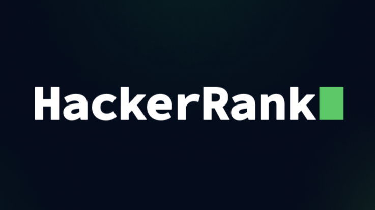

<h5 align="center">
  
<a></a> 

</h5>


<table align="center" width="100%">
  <tr>
    <td align="center">
      <picture>
        <source
          srcset="https://github-readme-stats.vercel.app/api?username=himelpaul&theme=github_dark&hide_title=true&hide_border=true&include_all_commits=false&count_private=true&show_icons=true&commits_year=2026&rank_icon=github"
          media="(prefers-color-scheme: dark)"
          />
        <source
          srcset="https://github-readme-stats.vercel.app/api?username=himelpaul&theme=buefy&icon_color=7957D5&hide_title=true&hide_border=true&include_all_commits=false&count_private=true&show_icons=true&commits_year=2026&rank_icon=github"
          media="(prefers-color-scheme: light)"
          />
        
      </picture>
    </td>
    <td align="center">
      <picture>
        <source
          srcset="https://nirzak-streak-stats.vercel.app/?user=himelpaul&theme=github_dark&hide_border=true"
          media="(prefers-color-scheme: dark)"
          />
        <source
          srcset="https://nirzak-streak-stats.vercel.app/?user=himelpaul&theme=buefy&hide_border=true"
          media="(prefers-color-scheme: light)"
          />
        
      </picture>
    </td>
  </tr>
</table>


<!-- Quotes -->
<h4 align="center">
  
```
 "There is nothing noble in being superior to your fellow man; true nobility is being superior to your former self"
- Ernest Hemingway
```
<br/>


<table align="center" width="100%">
  <tr>
    <td align="center" width="35%">
      <picture>
        <source
          srcset="https://github-readme-stats.vercel.app/api/top-langs/?username=himelpaul&theme=github_dark&hide_border=true&include_all_commits=true&count_private=true"
          media="(prefers-color-scheme: dark)"
        />
        <source
          srcset="https://github-readme-stats.vercel.app/api/top-langs/?username=himelpaul&theme=buefy&hide_border=true&include_all_commits=true&count_private=true"
          media="(prefers-color-scheme: light)"
        />
        
      </picture>
    </td>

  <td align="center" width="65%">
      <picture>
        <source
          srcset="https://leetcard.jacoblin.cool/rexeslab?theme=dark&font=Manjari&colors=%230D1117%2C%20%23404040%2C%20%23C3D1D9%2C%20%23C3D1D9&ext=heatmap"
          media="(prefers-color-scheme: dark)"
        />
        <source
          srcset="https://leetcard.jacoblin.cool/rexeslab?theme=light&font=Manjari&ext=heatmap&hide_border=true"
          media="(prefers-color-scheme: light)"
        />
        
     </picture>
    </td>
  </tr>
</table>


<h3 align="center">Competitive Programming Summary:</h3>

<table align="center" width="100%">
  <tr>
    <td align="center" width="33%">
      <a href="https://leetcode.com/u/rexeslab/">
        
      </a>
    </td>
    <td align="center" width="33%">
      <a href="https://www.hackerrank.com/profile/himelpaul">
        
      </a>
    </td>
    <td align="center" width="33%">
      <a href="https://codeforces.com/profile/himel_paul">
        
      </a>
    </td>
  </tr>
  <tr>
    <td align="center">
      <a href="https://www.leetcode.com/u/rexeslab/"><b>@himelpaul</b></a>
    </td>
    <td align="center">
      <a href="https://www.hackerrank.com/profile/himelpaul"><b>@himelpaul</b></a>
    </td>
    <td align="center">
      <a href="https://www.codeforces.com/profile/himel_paul"><b>@himelpaul</b></a>
    </td>
  </tr>
</table>


<h3 align="center">Languages and Tools:</h3>
<br/>
<div align="center">
  
  
  
  
  
  
  
  
  
  
  
  
  
  
  
  
  
  
  
  <br/>
  <br/>
  
  
  
  
  
  
  
  
  
  
  
  
  
  
  
  
  
  
  
  <br/>
  <br/>
  
  
  
  
  
  
  
  
  
</div>


<br/>
<h3 align="center">Connect with me:</h3>
<p align="center">
<a href="https://www.facebook.com/rexeslab23" target="blank"></a>&nbsp;&nbsp;&nbsp;&nbsp;
<a href="https://www.instagram.com/rexeslab23/" target="blank"></a>&nbsp;&nbsp;&nbsp;&nbsp;
<a href="https://www.linkedin.com/in/himelpaul" target="blank"></a>&nbsp;&nbsp;&nbsp;&nbsp;
<a href="https://mail.google.com/mail/?view=cm&fs=1&to=himelpaul23@gmail.com" target="blank"></a>&nbsp;&nbsp;&nbsp;&nbsp;
<a href="https://discord.com/users/1111292572950859896" target="blank"></a>
</p>
